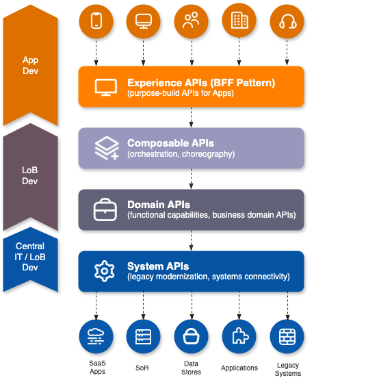

## Purpose

The purpose of this ADR is to document the architectural decision to implement transactional support in API connected applications within our distributed microservices architecture. This decision aims to:

- Enable reliable, orchestrated management of complex business workflows that span multiple business domains.
- Maintain clear separation of concerns between orchestration, business logic, and system integrations.
- Promote reusability, consistency, and decentralization of system integration contracts, particularly in a distributed, multi-location context.
- Ensure flexible, resilient, and maintainable transaction management strategies aligned with our organizational needs.
  
This ADR provides the rationale, scope, and guidance for implementing the outlined architecture, facilitating a consistent approach for development teams and stakeholders involved in designing, building, and maintaining our API ecosystem.

## Context

In our FUSION microservices-based application architecture, we have established a multi-layer API structure to enhance ourapplication's integration capabilities and to facilitate better separation of concerns. The architecture comprises four primary API layers:

- **BFF/Experience API**: Serves as the interface between the user interface (UI) and the backend services. It handles UI-specific transformations and optimisations to deliver tailored user experience, while making calls to the composable APIs.
- **Composable API**: Acts as an orchestrator, managing the integration and coordination of multiple Domain APIs. It facilitates complex workflows, enabling the development of new features that require interactions across various business doamins.
- **Domain API**: Represents atomic business capabilities corresponding to distinct business domains across the organisation. Each Domain API is designed to perform specific operations and is responsible for its ow data management and business logic.
- **System API**: Encapsulates connections to specific System of Records (SoR) and third-party applications/APIs.

## Decision

### Providing Transactional Support in Composable API Layer

We have decided to implement Transactional Support primarily at the Composable API level for the following reasons:

- **Orchestration of Multiple Domain Operations**: The Composable API layer is responsible for orchestrating calls to multiple Domain APIs. By managing transactionality at this layer, we can ensure all steps within a business workflow are executed seamlessly. In cases where one or more Domain API calls fail, the Composable API can invoke compensation logic, providing a coherent method to maintain data integrity.
- **Separation of Concerns**: Keeping the transaction management centralised within the Composable API ensures the Domain APIs remain focused on their core responsibilities -- implementing bsuiness logic gor individual domains -- while offloading the orchestration concerns to the Composble layer. This separation minimises the coupling between services.
- **Flexibility in Transaction Management**: By utilising the SAGA pattern within the Compsable API, we can flexibly choose betweeen orchestration or choreography based on the specific business process requirements. This flexibility allows us to adapt to changing needs without impacting the overall architecture.

### Role of System API Layer
  
The introduction of System APIs will provide several advantages to our architecture:

- **Standardization Across Locations**: System APIs will standardize interactions with SoR and third-party APIs, ensuring that all Domain APIs adhere to the same specifications or contracts regardless of the local system variations. This is particularly beneficial for a multinational organization.
- **Decoupling and Flexibility**: System APIs decouple the business logic in Domain APIs from specific technical implementations of SoR and third-party integrations. This allows for greater flexibility to update back-end systems without affecting higher-level business logic.
- **Improved Maintenance and Scalability**: Centralizing management of integrations via System APIs simplifies monitoring, logging, and error handling across diverse SoR interactions. This enables smoother scalability when entering new markets that require additional integrations.
- **Consistent Error Handling and Security**: Standardising error handling and security mechanisms across System APIs ensures a cohesive integration experience while safeguarding sensitive data and managing access uniformly.

### UI-Specific Role of BFF/Experience API Layer

The BFF/Experience API layer will focus on handling user interface requirements, ensuring:

- **User-Centric Data Handling**: This layer will interact with the Composable APIs to fetch and transform data specific to various channels and UI designs, enhancing user experience while abstracting complex transaction management.
- **Independence from Business Logic**: By limiting the BFF layer’s role to UX/UI data transformation and optimization, we maintain a clear divide between user experience and business logic, fostering a clean architecture that can adapt easily to future changes.

### Technical Details

- **Pattern for Transaction Management**
  - Utilize the SAGA pattern for orchestrating distributed transactions at the Composable API layer.
  - Decide between choreography or orchestration based on business process complexity, with orchestration preferred for more control.
- **Compensation Endpoints in Domain APIs**
  - Define standard conventions for compensation endpoints (e.g., `POST /<entity>/compensate`) within Domain APIs.
  - Ensure idempotency and consistency of compensation operations to prevent side effects during retries or failure scenarios.
- **API Contracts and Standards**-
  - Adopt OpenAPI or similar specifications for defining System, Domain, and Composable API contracts.
  - Version API contracts to manage evolution without breaking consumers.
- **Error Handling & Retry Strategies**
  - Implement robust error handling at each API level, including retries with exponential backoff, circuit breakers, and fallback mechanisms.
  - Propagate meaningful error responses to facilitate debugging and remediation.
- **Event-Driven Communication**
  - Consider leveraging async messaging or event sourcing within the SAGA orchestration to decouple steps and handle eventual consistency.
  - Use message brokers (e.g., Kafka, PubSub) for reliable event delivery and state management.
- **Security & Authentication**
  - Standardize security mechanisms across System APIs, using OAuth2, mutual TLS, or API keys.
  - Manage and rotate credentials centrally, especially for third-party or external integrations.
- **Observability & Monitoring**
  - Instrument all API calls with distributed tracing (e.g., Splunk, OpenTelemetry) for end-to-end observability.
  - Log transaction steps, failures, and compensations for auditability and troubleshooting.
- **Data Consistency & Idempotency**
  - Use idempotent operations for compensation and critical API actions to prevent duplicate effects.
  - Define explicit data consistency models (e.g., eventual consistency) suitable for the transactional scope.
- **Deployment & Scalability**
  - Deploy System and API gateways using container orchestration platforms (e.g., Kubernetes).
  - Ensure horizontal scalability, especially for the Composable layer handling complex workflows.
- **Documentation & Developer Guidance**
  - Maintain comprehensive API documentation, including transaction flows, compensation logic, error handling, and versioning policies.
  - Provide reference implementations (ERIs) for key transaction patterns to promote consistency.

### Diagram

  
## Consequences

- ### Positive

  - **Robust Transaction Management**: Centralizing transactional support at the Composable API level enables orchestrated workflows that maintain data consistency across multiple domains, reducing manual coordination efforts.
  - **Enhanced Flexibility and Scalability**: Utilizing the SAGA pattern allows the system to adapt transaction flows dynamically, supporting both orchestrated and choreographed approaches as needed.
  - **Reusability and Standardization**: The introduction of System APIs promotes contract reuse across multiple locations, improving consistency and simplifying integration management across the organization.
  - **Separation of Concerns**: Delegating compensation logic to Domain APIs helps keep business logic encapsulated, simplifying maintenance and evolution of services.

- ### Negative

  - **Increased Complexity**: Implementing distributed transaction management and compensation logic adds complexity to both development and operational processes, requiring careful design, testing, and monitoring.
  - **Latency and Performance Overhead**: Orchestrated workflows, especially involving multiple API calls and compensation steps, can introduce increased latency and resource consumption, impacting user experience.
  - **Error Propagation and Partial Failures**: Handling failures gracefully across multiple systems requires robust error handling and monitoring to prevent inconsistencies or incomplete transactions.
  - **Potential for Inconsistent State**: Despite compensation efforts, some failure scenarios may leave the system in an inconsistent state if compensating actions are not correctly implemented or invoked.

- ### Mitigations

  - **Design for Idempotency and Consistency**: Enforce idempotent operations for compensation endpoints and transactional steps to prevent side effects from retries or duplicate messages.
  - **Implement Robust Monitoring and Alerts**: Leverage distributed tracing, logging, and alerting tools to detect and respond swiftl  y to failures, enabling prompt recovery and troubleshooting.
  - **Optimize for Performance**: Use asynchronous messaging and event sourcing where appropriate to reduce latency impacts and decouple transaction steps, improving overall system responsiveness.
  - **Gradual Adoption and Testing**: Start with critical or high-value workflows, rigorously test transaction paths, and incrementally extend support to other areas to manage complexity and risk.
  - **Clear Documentation**: Provide comprehensive documentation on transaction flows, compensation mechanisms, error handling, and recovery procedures to ensure alignment and clarity across teams.

## Alternatives Considered

- ### No Distributed Transaction Support (Eventual Consistency Only)

  - **Description**: Rely solely on eventual consistency mechanisms, with each Domain API operating independently without coordinated transaction management.
  - **Rationale for Discarding**:
    - This approach simplifies implementation but sacrifices data consistency guarantees necessary for certain critical business workflows.
In scenarios involving multiple updates across domains, it can lead to data anomalies, making it unsuitable for workflows requiring transactional integrity.

- ### Two-Phase Commit (2PC) at the API Level

  - **Description**: Implement a distributed transaction protocol such as 2PC across services using a two-phase commit mechanism.
  - **Rationale for Discarding**:
    - 2PC introduces significant complexity, coordination overhead, and potential blocking issues in a distributed microservices environment.
It reduces system availability and scalability—issues that are contrary to microservices principles and organizational scalability goals.
Given the asynchronous and loosely coupled nature of our architecture, 2PC was deemed too rigid and impractical.

## References

- [SAGA Pattern](https://microservices.io/patterns/data/saga.html)
- [ERI - Transactional Management Implementation](TBD)
