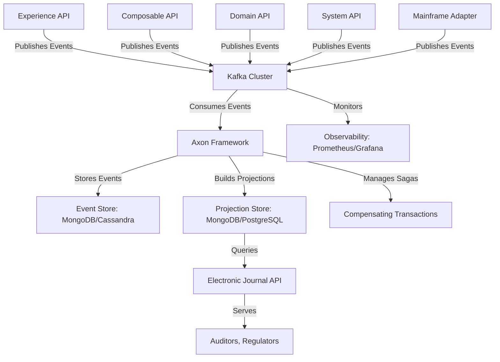

## Purpose

The purpose of this ADR is to document the architectural decision to implement a Distributed Electronic Journal using an Event Sourcing pattern to capture and audit customer and employee interactions across assisted (e.g., financial terminals, intranet portals, CRM) and unassisted (e.g., mobile and web banking) channels. This decision aims to:

- Provide a complete, immutable, and auditable record of all customer interactions to meet legal and regulatory requirements.
- Transition the electronic journal functionality from the legacy Mainframe to a modern, distributed microservices architecture.
- Enable flexibility for future use cases, such as analytics or fraud detection, by leveraging event-driven data.
- Ensure high performance and scalability to handle high event volumes while minimizing impact on API response times.
- Support semi-transactional requirements for critical operations, ensuring data integrity without compromising performance.

This ADR provides the rationale, scope, and guidance for implementing the Distributed Electronic Journal, ensuring alignment with our API-first microservices architecture and facilitating adoption by development teams.

## Context

Our FUSION microservices-based architecture is designed to support a multi-layer API structure, comprising:

- **BFF/Experience API**: Tailors responses for specific user interfaces, calling Composable or Domain APIs without implementing business logic.
- **Composable API**: Orchestrates calls to multiple Domain APIs to support complex workflows or reusable business processes.
- **Domain API**: Encapsulates atomic business capabilities within a specific domain, adhering to Domain-Driven Design (DDD) boundaries.
- **System API**: Standardizes interactions with Systems of Record (SoR) and third-party systems, normalizing their contracts for Domain APIs.

Currently, the electronic journal, which records all customer interactions for legal auditing purposes, resides in our Mainframe z/OS environment, part of our legacy core banking system. This approach has several limitations:

- Limited data exploitation due to the Mainframe's constraints.
- Historical data stored on tapes, making access cumbersome.
- Incomplete capture of interactions as new functionalities are extracted to distributed systems.
- High complexity and cost of maintaining and extending Mainframe-based auditing.

To address these challenges, we aim to migrate the electronic journal to our distributed architecture, leveraging our API-led connectivity model. The solution must handle high event volumes, support semi-transactional requirements for critical operations, and ensure eventual consistency within minutes, aligning with regulatory needs.

## Decision

### Implementing a Distributed Electronic Journal with Event Sourcing

We have decided to implement the Distributed Electronic Journal using an **Event Sourcing** pattern, supported by **Apache Kafka** for event streaming, **Axon Framework** for Event Sourcing and CQRS, and an open-source database (e.g., MongoDB or Cassandra) for event storage and projections. The key components of this decision are:

- **Event Sourcing for Auditability**:
  - All customer and employee interactions (e.g., logins, transactions, queries) will be captured as immutable events stored in an event store.
  - The electronic journal will be reconstructed by replaying these events or querying materialized projections, ensuring a complete and auditable record.
  - Events will serve as the single source of truth, supporting legal auditing and enabling future use cases like analytics or fraud detection.

- **Kafka as the Event Streaming Layer**:
  - Apache Kafka will be used as the event streaming platform to capture and distribute events generated by APIs (Experience, Composable, Domain).
  - Kafka ensures high throughput and scalability to handle large event volumes, with low-latency event persistence to minimize impact on API response times.
  - Events will be published to Kafka topics with durability guarantees (`acks=all`, multiple replicas) to meet semi-transactional requirements.

- **Axon Framework for Event Sourcing and CQRS**:
  - Axon Framework (OSS) will be used to implement Event Sourcing and CQRS, modeling interactions as aggregates and handling event processing.
  - Sagas will be used to manage compensating transactions for critical operations, ensuring data integrity in failure scenarios.
  - Axon integrates seamlessly with our Spring Boot-based framework, facilitating adoption by development teams.

- **Open-Source Database for Event Storage and Projections**:
  - A NoSQL database (e.g., MongoDB or Cassandra) will serve as the event store, storing raw events for reconstruction and auditing.
  - Materialized projections will be stored in a separate database (e.g., MongoDB for flexibility or PostgreSQL for structured queries) to support efficient querying of the electronic journal.
  - Snapshots will be implemented to optimize state reconstruction for aggregates with high event volumes.

- **Semi-Transactional Requirements**:
  - For critical operations, an interaction will be considered valid once the corresponding event is persisted in Kafka, ensuring low-latency API responses.
  - If subsequent processing fails, Sagas will trigger compensating actions to rollback or mitigate the operation, maintaining data integrity.
  - Non-critical operations will rely on eventual consistency, with a tolerance of minutes for projection updates.

- **Transition from Mainframe**:
  - During the migration, the Mainframe-based journal will coexist with the distributed system. Events from Mainframe interactions will be generated via System APIs or adapters and published to Kafka.
  - Deduplication using correlation IDs will prevent redundant events during the transition period.
  - Once all critical capabilities are migrated to the distributed architecture, the Mainframe journal will be phased out.

### Technical Details

- **Event Generation**:
  - APIs (Experience, Composable, Domain) will publish events to Kafka topics for each relevant interaction (e.g., `CustomerLoggedIn`, `TransactionCompleted`).
  - Events will follow a standardized format (e.g., CloudEvents) and include a correlation ID for deduplication and traceability.
  - Kafka producers will be configured with `acks=all` and multiple replicas for durability.

- **Kafka Configuration**:
  - Use partitioned topics to scale event processing, with partitions based on customer ID or interaction type.
  - Implement Kafka Schema Registry to manage event schemas and ensure compatibility.
  - Set retention policies (e.g., 7 years) to meet legal auditing requirements.

- **Axon Implementation**:
  - Model aggregates (e.g., per customer or session) to manage interaction state.
  - Use Axon’s event handlers to build materialized projections for the electronic journal.
  - Implement Sagas for compensating transactions in critical operations.
  - Integrate Axon with Spring Boot and Kafka for seamless event publishing and consumption.

- **Database Selection**:
  - **MongoDB** or **Cassandra** for the event store, with MongoDB preferred for its flexibility and Axon integration, and Cassandra for high write throughput.
  - **PostgreSQL** or **MongoDB** for materialized projections, depending on query requirements (structured vs. flexible).
  - Implement snapshots in Axon to optimize performance for aggregates with many events.

- **Observability and Monitoring**:
  - Instrument APIs, Kafka, and Axon with distributed tracing (e.g., OpenTelemetry) and metrics (e.g., Prometheus).
  - Log event processing failures and compensations for auditability.
  - Set up alerts for critical failures in event persistence or processing.

- **Governance**:
  - Maintain an event catalog documenting event types, schemas, and their relation to business capabilities.
  - Use Kafka Schema Registry for schema evolution and compatibility.
  - Provide reference implementations and accelerators in Spring Boot for event generation and consumption.

### Diagram

## Consequences

### Positive

- **Complete Auditability**: Event Sourcing ensures an immutable, auditable record of all interactions, meeting legal and regulatory requirements.
- **Scalability**: Kafka’s distributed architecture handles high event volumes, supporting millions of interactions daily.
- **Performance Optimization**: Asynchronous event persistence in Kafka minimizes API response times, ensuring a seamless user experience.
- **Flexibility**: The event-driven approach enables future use cases (e.g., analytics, fraud detection) without modifying the core system.
- **Alignment with Architecture**: Integrates seamlessly with our Spring Boot-based framework and API-led connectivity model.
- **Incremental Migration**: Supports coexistence with the Mainframe journal, enabling a gradual transition to the distributed system.

### Negative

- **Increased Complexity**: Event Sourcing and Kafka introduce operational and development complexity, requiring team training and robust governance.
- **Eventual Consistency**: While acceptable, the minutes-long delay in projection updates may require careful management for certain use cases.
- **Infrastructure Overhead**: Managing Kafka, Axon, and databases requires significant infrastructure and operational expertise.
- **Deduplication Challenges**: During the Mainframe transition, deduplication of events requires careful design to avoid redundancy.

### Mitigations

- **Team Enablement**: Provide accelerators, reference implementations, and training on Event Sourcing and Axon to reduce the learning curve.
- **Robust Governance**: Maintain an event catalog and use Schema Registry to manage event schemas and evolution.
- **Monitoring and Alerts**: Implement comprehensive observability with OpenTelemetry and Prometheus to detect and resolve issues quickly.
- **Deduplication Strategy**: Use correlation IDs and deduplication logic in Axon to handle redundant events during the transition.
- **Performance Optimization**: Use snapshots and efficient projection designs to reduce state reconstruction overhead.

## Alternatives Considered

### EventStoreDB (OSS)

- **Description**: Use the open-source version of EventStoreDB as the event store, leveraging its native support for Event Sourcing.
- **Rationale for Discarding**:
  - The OSS version lacks clustering and high availability, making it unsuitable for high event volumes in a financial institution.
  - Slower, more synchronous writes compared to Kafka increase API response times, conflicting with performance requirements.
  - Limited scalability compared to Kafka, which is better suited for distributed, high-throughput environments.

### Direct Database Storage (No Event Sourcing)

- **Description**: Store interaction data directly in a relational or NoSQL database without using Event Sourcing.
- **Rationale for Discarding**:
  - Lacks the immutability and auditability provided by Event Sourcing, critical for legal compliance.
  - Limits flexibility for future use cases like analytics or historical state reconstruction.
  - Increases coupling between APIs and the database, reducing scalability and maintainability.

## References

- [Event Sourcing Pattern](https://martinfowler.com/eaaDev/EventSourcing.html)
- [Apache Kafka Documentation](https://kafka.apache.org/documentation/)
- [Axon Framework Documentation](https://docs.axoniq.io/reference-guide/)
- [CloudEvents Specification](https://cloudevents.io/)
- [ERI - Event Sourcing Implementation](ERIs/eri-002-Distributed-Electronic-Journal)

---
