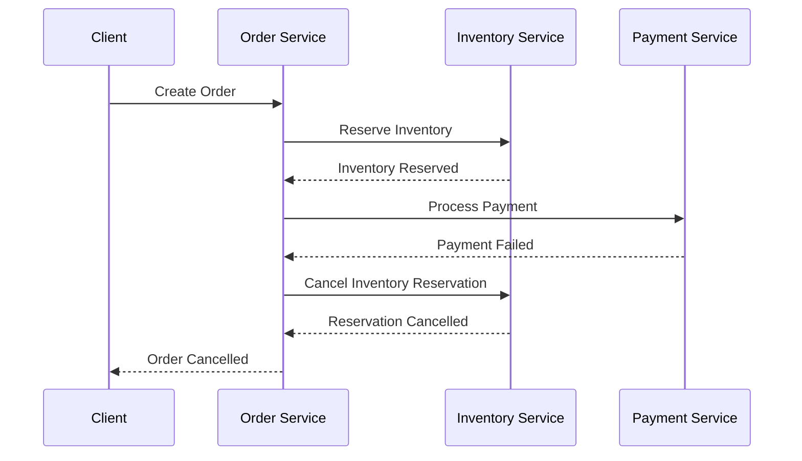

## Summary

The **SAGA** pattern is a strategy for managing distributed transactions within microservices architectures, where the involved operations cannot be encapsulated within a single ACID transaction. Instead, the overall operation is divided into a sequence of local transactions, each with a corresponding compensation step to revert changes in case of failure.

## Diagram

## Context

The **SAGA** pattern is suitable in environments where:

- Operations span multiple microservices.
- Strict ACID transactions are impractical due to performance and scalability constraints.
- Eventual consistency is acceptable, mediated via compensating actions.
- High resilience and fault tolerance are required, allowing services to continue operating despite partial failures.

## Solution

The **SAGA** pattern involves dividing a complex operation into multiple transactional steps, coordinated either via:

- **Orchestration**: A central coordinator (orchestrator) manages each step, determining the flow, handling errors, and executing compensations if needed.
- **Choreography**: Services communicate through events, engaging in a collaborative process where each service executes its step and publishes relevant events to trigger subsequent steps, including compensations if errors occur.

In both approaches, each step has an associated compensation action to revert the changes made in case of failure, aiming to restore consistency.

## Variants

- **Orchestrated Saga**: Centralized control with a dedicated orchestrator that dictates the sequence of steps.
- **Choreographed Saga**: Decentralized, relying on event-driven communication among services.
- **Hybrid Approach**: Combining orchestration and choreography for different parts of the process depending on requirements.

## Consequences

### Positive

- High scalability and system availability.
- No need for distributed locking or coordination.
- Facilitates complex distributed data consistency.
- Supports recovery from failures using compensation actions.

### Negative

- Increased design and implementation complexity.
- Challenges in ensuring consistency during prolonged failures.
- Latency overhead due to multiple steps and compensations.
- Complex compensation logic that must be carefully designed and tested.

### Mitigations

- Design idempotent operations for all steps and compensations.
- Use reliable messaging systems with at-least-once delivery guarantees.
- Implement comprehensive monitoring and tracing for rapid failure detection.
- Conduct thorough testing, including chaos engineering simulations to validate recovery procedures.

## Implementation

- Clearly define each transactional step and its corresponding compensation.
- Choose between orchestration and choreography based on process complexity.
- Use reliable messaging and eventing platforms (e.g., Kafka, RabbitMQ).
- Automate retries, dead-letter handling, and error notifications.
- Document flow diagrams, state machines, and compensation logic explicitly.

## Example

Consider an e-commerce order process involving:

1. Reserving inventory in the inventory service.
2. Creating an order record in the order management system.
3. Processing payment.

If payment fails, the compensating actions would be:

- Release the inventory reservation.
- Cancel the order.

Steps are executed sequentially, with compensations triggered on failure, ensuring no partial updates remain.

## Additional Notes

- Clearly define success and failure conditions for each step.
- Make compensation actions as simple and reliable as possible.
- Adapt whether to orchestrate or choreograph based on process complexity and operational needs.

## References

- [Implementing the Saga Pattern](https://microservices.io/patterns/data/saga.html)
- Vogels, W. (2015). *Designing Data-Intensive Applications*. O'Reilly Media.
