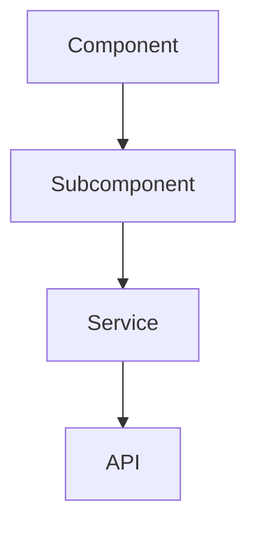

# ADR-XXX: [Title of the Decision]

## Context
[Describe the problem or need driving the decision. Provide background, technical constraints, and requirements. For example, "The system requires a scalable solution for handling user authentication across multiple services."]

## Decision
[State the decision made, including technical details. For example, "We will implement JWT-based authentication with OAuth 2.0 for secure and scalable user access."]

### Technical Details
- [Detail 1: e.g., "Technology: JSON Web Tokens (JWT)."]
- [Detail 2: e.g., "Framework: Keycloak for OAuth 2.0 integration."]
- [Detail 3: e.g., "Deployment: Kubernetes with Helm charts."]

### Diagram

[Optional: Replace with a relevant Mermaid diagram illustrating the decision, or remove this section if not applicable.]

## Consequences
- **Positive**:
  - [Benefit 1: e.g., "Improved scalability for user authentication."]
  - [Benefit 2: e.g., "Simplified integration with third-party services."]
- **Negative**:
  - [Risk 1: e.g., "Increased complexity in token management."]
  - [Risk 2: e.g., "Dependency on external identity provider."]
- **Mitigations**:
  - [Mitigation 1: e.g., "Implement token refresh mechanisms."]
  - [Mitigation 2: e.g., "Document integration procedures."]

## Alternatives Considered
- **[Alternative 1]**: [Description and why it was rejected. e.g., "SAML-based authentication: Rejected due to higher complexity and lower adoption."]
- **[Alternative 2]**: [Description and why it was rejected. e.g., "Session-based authentication: Rejected due to poor scalability."]

## References
- [Reference 1: e.g., "[OAuth 2.0 Specification](https://oauth.net/2/)"]
- [Reference 2: e.g., "[Internal Authentication Guide](/docs/frameworks/auth)"]